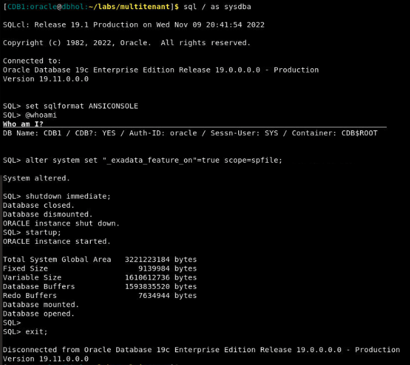
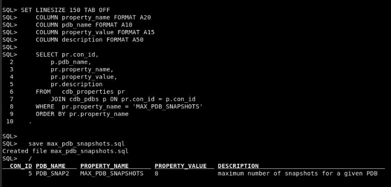

# Multitenant 19c New Features

## Introduction
In this lab you will try out new features of Multitenant. You will create and configure a PDB snapshot carousel which is a library of point-in-time copy of a PDB. You will set up restore points specific for a pluggable database (PDB) to flashback to that restore point without affecting other PDBs in a multitenant container database (CDB). You will also create the configuration to monitor and manage a fleet of container databases (CDBs) and hosted pluggable databases (PDBs).

Estimated Time: 2 hour

[](youtube:kzTQGs75IjA)


### Prerequisites

This feature is currently restricted to Enterprise Edition on Engineered Systems, like Exadata, and Enterprise Edition on Oracle Database Cloud Services, as described [here](https://docs.oracle.com/en/database/oracle/oracle-database/19/dblic/Licensing-Information.html#GUID-0F9EB85D-4610-4EDF-89C2-4916A0E7AC87). There is a workaround for testing by enabling the "_exadata_feature_on" initialisation parameter.

**NOTE:** *When doing Copy/Paste using the convenient* **Copy** *function used throughout the guide, you must hit the* **ENTER** *key after pasting. Otherwise the last line will remain in the buffer until you hit* **ENTER!**

    ```
    <copy>
    exit
    </copy>
    ```
    ```
    <copy>
    . ~/.set-env-db.sh CDB1
    </copy>
    ```

    ```
    <copy>
    sql / as sysdba
    set sqlformat ANSICONSOLE
    @whoami
    </copy>
    ```

    ```
    <copy>
    alter system set "_exadata_feature_on"=true scope=spfile;
    shutdown immediate;
    startup;

    exit;
    </copy>
    ```

    

## Task 1: Log in and create PDB Snapshot Carousel

Support for PDB snapshots can be defined during PDB creation as part of the **CREATE PLUGGABLE DATABASE** statement, or after PDB creation using the **ALTER PLUGGABLE DATABASE** statement. The **SNAPSHOT MODE** clause accepts one of the following settings.

* NONE : The PDB does not support snapshots.
* MANUAL : The PDB supports snapshots, but they are only created manually requested.
* EVERY n HOURS : A snapshot is automatically created every "n" hours. Where "n" is between 1 and 1999.
* EVERY n MINUTES : A snapshot is automatically created every "n" minutes. Where "n" is between 1 and 2999.

**NOTE:** If you are using Oracle Managed Files (OMF) you don't need to worry about file name conversion. If you aren't using OMF, all PDB creation statements will require file name conversion using the **FILE_NAME_CONVERT** or **CREATE_FILE_DEST** settings in the CREATE PLUGGABLE DATABASE statements.

1. All scripts for this lab are stored in the `labs/multitenant` folder and are run as the oracle user. Let's navigate to the path now.

    ```
    <copy>
    cd /home/oracle/labs/multitenant
    </copy>
    ```

2.  Set your oracle environment and connect to **CDB1** using SQLcl.

    ```
    <copy>. ~/.set-env-db.sh CDB1</copy>
    ```

    ```
    <copy>
    sql sys/Ora_DB4U@localhost:1521/cdb1 as sysdba
    </copy>
    ```

    To make the SQLcl output easier to read on the screen, set the sql format.

    ```
    <copy>
    set sqlformat ANSICONSOLE
    @whoami.sql
    </copy>
    ```

3. Create a PDB Snapshot Carousel **PDB_SNAP2**.

    ```
    <copy>show pdbs
    </copy>
    ```

    ```
    <copy>

    create pluggable database PDB_SNAP2 admin user PDB_Admin identified by Ora_DB4U snapshot mode every 1 hours;

    alter pluggable database PDB_SNAP2 open;

    show pdbs
    </copy>
    ```

    

4. Create a script to check to display PDB snapshot carousel settings. The snapshot settings are displayed using the _SNAPSHOT\_MODE_ and _SNAPSHOT\_INTERVAL_ columns in the _CDB\_PDBS_ view. Notice the _SNAPSHOT\_INTERVAL_ values are displayed in minutes. We'll save this script for future use and call it "pdb\_snapshot\_mode.sql".

    ```
    <copy>
      COLUMN pdb_name FORMAT A10
      COLUMN snapshot_mode FORMAT A15
  
      SELECT p.con_id,
          p.pdb_name,
          p.snapshot_mode,
          p.snapshot_interval
      FROM   cdb_pdbs p
      ORDER BY 1
      .

      save pdb_snapshot_mode.sql
      /

    </copy>
    ```

    Now, let's run the script.

    ```
    <copy>
     @pdb_snapshot_mode.sql
    </copy>
    ```
    

5. Change the session to point to **PDB_SNAP2**.

    ```
    <copy>alter session set container = PDB_SNAP2;</copy>
    ```

6. Alter the snapshot settings using the **ALTER PLUGGABLE DATABASE** command in **PDB_SNAP2**.

    ```
    <copy>
    alter pluggable database snapshot mode every 1 minutes;
    @pdb_snapshot_mode.sql
    </copy>
    ```

    ```
    <copy>
    alter pluggable database snapshot mode manual;
    @pdb_snapshot_mode.sql
    </copy>
    ```
    ```
    <copy>
    alter pluggable database snapshot mode none;
    @pdb_snapshot_mode.sql
    </copy>
    ````

    ```
    <copy>
    alter pluggable database snapshot mode every 30 minutes;
    @pdb_snapshot_mode.sql
    </copy>
    ````

   


7. Create a script to report current MAX_PDB_SNAPSHOT parameter value using CDB_PROPERTIES view in **PDB_SNAP2**, save the script as max_pdb_snapshots.sql.

    ```
    <copy>
        SET LINESIZE 150 TAB OFF
        COLUMN property_name FORMAT A20
        COLUMN pdb_name FORMAT A10
        COLUMN property_value FORMAT A15
        COLUMN description FORMAT A50

        SELECT pr.con_id,
            p.pdb_name,
            pr.property_name, 
            pr.property_value,
            pr.description 
        FROM   cdb_properties pr
            JOIN cdb_pdbs p ON pr.con_id = p.con_id 
        WHERE  pr.property_name = 'MAX_PDB_SNAPSHOTS' 
        ORDER BY pr.property_name
      .

      save max_pdb_snapshots.sql
      /

    </copy>
    ```

    ```
    <copy>
    alter pluggable database set max_pdb_snapshots=8;
    @max_pdb_snapshots.sql
    </copy>
    ```

   
   

8. Take snapshot of the PDB manually 

    ```
    <copy>
    connect sys/Ora_DB4U@localhost:1521/cdb1 as sysdba
    alter session set container = PDB_SNAP2;
    </copy>
    ```
    
    ```
    <copy>
    alter pluggable database snapshot;
    alter pluggable database snapshot my_snapshot;
    alter pluggable database snapshot my_snapshot_save;
    </copy>
    ```

    

9.  List available snapshots of PDB using **CDB_PDB_SNAPSHOTS** view. Save the script as pdb_snapshots.sql.

    ```
    <copy>
        SET LINESIZE 150 TAB OFF
        COLUMN con_name FORMAT A10
        COLUMN snapshot_name FORMAT A30
        COLUMN snapshot_scn FORMAT 9999999
        COLUMN full_snapshot_path FORMAT A50

        SELECT con_id,
            con_name,
            snapshot_name, 
            snapshot_scn,
            full_snapshot_path 
        FROM   cdb_pdb_snapshots
        ORDER BY con_id, snapshot_scn
      .

      save pdb_snapshots.sql
      /

    </copy>
    ```

    

10. Drop the snapshot manually. It works for snapshots with user-defined or system generated names.
    
    ```
    <copy>
    alter pluggable database drop snapshot my_snapshot;
    </copy>
    ```

    ```
    <copy>    
    @pdb_snapshots.sql
    </copy>
    ```

    

11. Create PDB clone from PDB snapshot.

    ```
    <copy>
    connect sys/Ora_DB4U@localhost:1521/cdb1 as sysdba
    </copy>
    ```

    ```
    <copy>
    create pluggable database pdb2_my_snapshot from pdb_snap2 using snapshot my_snapshot_save snapshot mode every 24 hours;
    </copy>
    ```

    ```
    <copy>
    alter pluggable database pdb2_my_snapshot open;
    </copy>
    ```

    ```
    <copy>    
    @pdb_snapshot_mode.sql
    </copy>
    ```

    ```
    <copy>    
    exit
    </copy>
    ```

    

12. Cleanup PDB snapshot clones

    ```
    <copy>
    alter pluggable database pdb2_my_snapshot close; 
    alter pluggable database pdb_snap2 close;
    </copy>
    ```

    ```
    <copy>
    drop pluggable database pdb2_my_snapshot including datafiles;
    drop pluggable database pdb_snap2 including datafiles; 
    </copy>
    ```

## Task 2: PDB Flashback
In Oracle Database 12.1 flashback database operations were limited to the root container, and therefore affected all pluggable databases (PDBs) associated with the root container. Oracle Database now supports flashback of a pluggable database, making flashback database relevant in the multitenant architecture again.

The task you will do in this step is:
- Create Restore Points in **PDB2** and Flashback database **PDB2** to restore point to rollback unwanted changes. 

    Make the FRA area folder for flashback logs

    ```
    <copy>
    mkdir -p /opt/oracle/oradata/FRA
    sqlplus /nolog
    </copy>
    ```

1. Enable/Disable Flashback Database **CDB1**.

    ```
    <copy>
    connect sys/Ora_DB4U@localhost:1521/cdb1 as sysdba
    archive log list
    alter system set db_recovery_file_dest='/opt/oracle/oradata/FRA' scope=spfile; 
    alter system set db_recovery_file_dest_size=15G scope=both; 
    </copy>
    ```

    ```
    <copy>
    shutdown immediate
    startup mount
    alter database archivelog;
    alter database open;
    </copy>
    ```

    ```
    <copy>
    alter database flashback on;
    select name, open_mode, flashback_on from v$database;
    </copy>
    ```
    

2. Update database parameter **DB\_FLASHBACK\_RETENTION\_TARGET** to retain amount of flashback logs for 7 days.

    ```
    <copy>
    alter pluggable database all open read write;
    show pdbs 
    alter system set db_flashback_retention_target=10080 scope=both;
    </copy>
    ```

3. Create Restore Points at PDB level in **PDB2**.

    ```
    <copy>
    alter session set container=PDB2;
    create restore point PDB2_BEFORE_T1;
    </copy>
    ```

   

4. Create table t1 in **PDB2**.

    ```
    <copy>
    create table T1 (a number, b varchar2(50)); 
    insert into T1 values (1, 'A'); 
    commit;
    select * from T1;
    </copy>
    ```

   

5. Create Guaranteed Restore Point in root container for **PDB2**.

    ```
    <copy>
    connect sys/Ora_DB4U@localhost:1521/cdb1 as sysdba
    show pdbs
    </copy>
    ```

    ```
    <copy>
    create restore point PDB2_BEFORE_T2 for pluggable database PDB2 guarantee flashback database;
    </copy>
    ```

    ```
    <copy>
    select name, scn, guarantee_flashback_database from v$restore_point; 
    </copy>
    ```

   

6. Create table t2 in **PDB2**

    ```
    <copy>
    alter session set container=PDB2;
    </copy>
    ```
   
    ```
    <copy>
    create table T2 (x number); 
    insert into T2 values (100); 
    commit;
    select * from T2;
    </copy>
    ```

    ```
    <copy>
    select table_name from user_tables where table_name in ('T1','T2');
    </copy>
    ```   

    

7. Flashback database **PDB2** to GRP **PDB2\_BEFORE\_T2** 

    ```
    <copy>
    connect sys/Ora_DB4U@localhost:1521/cdb1 as sysdba
    show pdbs
    </copy>
    ```

    ```
    <copy>
    alter pluggable database PDB2 close;
    flashback pluggable database PDB2 to restore point PDB2\_BEFORE\_T2;
    alter pluggable database PDB2 open resetlogs;
    </copy>
    ```
    

    ```
    <copy>
    alter session set container=PDB2;
    select table_name from user_tables where table_name in ('T1','T2');
    select * from T2;
    </copy>
    ``` 

   ```
    <copy>
    exit
    </copy>
    ```     

    

## Task 3: CDB Fleet Management
Oracle 19c allows you to monitor multiple container databases centrally as a fleet. 

- CDB Fleet Lead Setup

1. Connect to the CDB root container on the **CDB1** that will be the fleet lead, and set the LEAD_CDB parameter to TRUE.

    ```
    <copy>
    sqlplus /nolog
    connect sys/Ora_DB4U@localhost:1521/cdb1 as sysdba
    </copy>
    ```

    ```
    <copy>
    ALTER DATABASE SET lead_cdb = TRUE;

    COLUMN property_name FORMAT A30
    COLUMN property_value FORMAT A30

    SELECT property_name, property_value 
    FROM   database_properties 
    WHERE  property_name = 'LEAD_CDB';
    </copy>
    ```

    

2. The fleet members will need database links back to the lead **CDB1**, so create a common user to be used for these database link connections. 

    ```
    <copy>connect sys/Ora_DB4U@localhost:1522/cdb2 as sysdba</copy>
    ```

    ```
    <copy>
    CREATE PUBLIC DATABASE LINK lead_cdb_link CONNECT TO c##cdb_fleet_link_user IDENTIFIED BY cdb_fleet_link_user USING 'cdb1';
    ALTER DATABASE SET lead_cdb_uri = 'dblink:LEAD_CDB_LINK';
    </copy>
    ```

    ```
    <copy>
    SELECT property_value
    FROM   database_properties
    WHERE  property_name = 'LEAD_CDB_URI';
    </copy>
    ```
   

    ```
    <copy>
    show pdbs
    alter pluggable database all open; 
    </copy>
    ```

   

3. Test CDB Fleet management.

    ```
    <copy>connect sys/Ora_DB4U@localhost:1521/cdb1 as sysdba</copy>
    ```

    ```
    <copy>
    COLUMN name FORMAT A30
    COLUMN proxy_pdb FORMAT A10

    SELECT con_id,
        name,
        open_mode,
        proxy_pdb
    FROM v$pdbs
    ORDER BY name;
    </copy>
    ```

   

   **Note:**We can see the "pdb4" and "pdb5" pluggable databases are visible from the "cdb1" root container. The output of the PROXY_PDB column gives us a clue what is really happening here. The "pdb4" and "pdb5" pluggable databases are actually a type of proxy PDB in this root container, but they don't have all the functionality of a conventional proxy PDB, as the subset of tablespaces (SYSTEM, SYSAUX, TEMP and UNDO) are not created locally.

    Once the fleet is configured, we can query container data objects (V$, GV$, CDB_, and some Automatic Workload Repository DBA_HIST* views) across the whole fleet.

4. Create a common user and a common object in each of containers (ROOT and PDB) for each instance. We will only be querying the contents of the PDBs, so we don't need to populate those in the root container. They are only present to prevent us getting errors.
    
    ```
    <copy>
    connect sys/Ora_DB4U@localhost:1521/cdb1 as sysdba
    CREATE USER c##common_user IDENTIFIED BY Common1 QUOTA UNLIMITED ON users;
    GRANT CREATE SESSION, CREATE TABLE, CREATE VIEW, CREATE SYNONYM TO c##common_user CONTAINER=ALL;
    </copy>
    ```

    ```
    <copy>
    CONN c##common_user/Common1@cdb1
    CREATE TABLE c##common_user.common_user_tab (id NUMBER);
    </copy>
    ```

    ```
    <copy>
    CONN c##common_user/Common1@pdb1
    CREATE TABLE c##common_user.common_user_tab AS
    SELECT level AS ID
    FROM   dual
    CONNECT BY level <= 2;
    </copy>
    ```
4. Create a common user and a common object in **CDB2** (ROOT and PDB).

    ```
    <copy>
    connect sys/Ora_DB4U@localhost:1522/cdb2 as sysdba
    CREATE USER c##common_user IDENTIFIED BY Common1 QUOTA UNLIMITED ON users;
    GRANT CREATE SESSION, CREATE TABLE, CREATE VIEW, CREATE SYNONYM TO c##common_user CONTAINER=ALL;
    </copy>
    ```

    ```
    <copy>
    CONN c##common_user/Common1@cdb2
    CREATE TABLE c##common_user.common_user_tab (id NUMBER);
    </copy>
    ```
    
    ```
    <copy>
    CONN c##common_user/Common1@oe
    CREATE TABLE c##common_user.common_user_tab AS
    SELECT level AS ID
    FROM   dual
    CONNECT BY level <= 2;
    </copy>
    ```

    

5. We can now connect to the common user in the CDB fleet lead and query the contents of the common object in each PDB.

    ```
    <copy>
    conn c##common_user/Common1@cdb1
    SELECT a.con_id, COUNT(*)
    FROM   CONTAINERS(common_user_tab) a
    GROUP BY a.con_id
    ORDER BY 1;
    </copy>
    ```

    

## Task 11: Lab cleanup

1. Exit from the SQL command prompt and reset the container databases back to their original ports. If any errors about dropping databases appear, you can ignore them.

    ```
    <copy>
    exit
    </copy>
    ```
    ```
    <copy>
    ./resetCDB.sh
    </copy>
    ```

    

Now you've had a chance to try out the Multitenant option. You were able to create, clone, plug and unplug a pluggable database. You were then able to accomplish some advanced tasks, such as hot cloning and PDB relocation, that you could leverage to more easily maintain a large multitenant environment.

Please *proceed to the next lab*.

## Acknowledgements

- **Author** - Patrick Wheeler, VP, Multitenant Product Management
- **Contributors** -  Joseph Bernens, David Start, Anoosha Pilli, Brian McGraw, Quintin Hill, Rene Fontcha, Alfredo Krieg, Royce Fu
- **Last Updated By/Date** - Royce Fu, North America Cloud & Technology, October 2021
