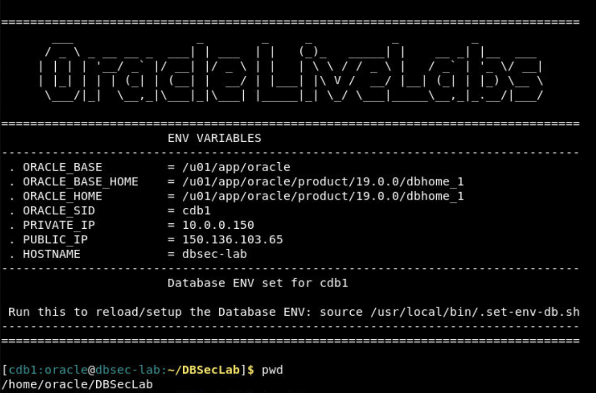

# Enable Advanced Compression along with TDE 

## Introduction

Oracle has been a pioneer in database compression technology. Oracle Database 9i introduced Basic Table Compression several years ago that compressed data loaded using bulk load operations. Oracle Database 11g Release 1 introduced a new OLTP Table Compression feature that reduces the associated compression overhead of write operations making it suitable for transactional or OLTP environments as well. OLTP Table Compression, therefore, extends the benefits of compression to all application workloads. OLTP Table Compression was renamed to Advanced Row Compression starting with Oracle Database release 12c.

Advanced row compression enables table data to be compressed during all types of data manipulation operations, including DML INSERT and UPDATE operations. The intelligent algorithm minimizes compression overhead during write operations, making compression viable for data warehouse and OLTP workloads. The benefits of Advanced row compression go beyond just on-disk storage savings. One significant advantage is Oracle’s ability to read compressed blocks (data and indexes) directly, in memory, without uncompressing the blocks. This helps improve performance due to the reduction in I/O and system calls related to the I/O operations. Further, the buffer cache becomes more efficient by storing more data without adding memory.

Estimated Time: 90 minutes

### About Advanced Row Compression

Advanced row compression uses a unique compression algorithm specifically designed to work with OLTP/DW applications. The algorithm eliminates duplicate values within a database block, even across multiple columns. Compressed blocks contain a structure called a symbol table that maintains compression metadata. When a block is compressed, duplicate values are eliminated by first adding a single copy of the duplicate value to the symbol table. Each duplicate value is then replaced by a short reference to the appropriate entry in the symbol table. Compressed data is self-contained within the database block through this innovative design, as the metadata used to translate compressed data into its original state is stored in the block header. When compared with competing compression algorithms that maintain a global database symbol table, Oracle’s approach offers significant performance benefits by not introducing additional I/O (needed with a global symbol table) when accessing compressed data.

### Data growth challenges 

Exponential data growth has put severe pressure from a cost, performance, scalability and management perspective. It has become imperative to employ more efficient ways of storing and managing data to meet the growing demands on IT systems. The rapid growth in data volumes and associated costs are of significant concern for many companies. The companies have started a global initiative to identify and drive a reduction in storage costs. 

### About Index Compression

Reduces the size of all supported unique and non-unique indexes- Advanced Index Compression HIGH automatically chooses the right compression per index block. Advanced Index Compression provides significant space savings while also improving performance for queries that are executed using indexes.

### SecureFiles LOB compression

SecureFiles LOB Compression utilizes industry-standard compression algorithms to minimize the storage requirements of SecureFiles data. With SecureFiles LOB Compression, typical files such as documents or XML files experience a reduction of 2x to 3x times in size. There are three levels of SecureFiles LOB Compression:  LOW, MEDIUM, and HIGH. By default, SecureFiles LOB Compression uses the MEDIUM level, which typically provides good compression with a modest CPU overhead. In addition to SecureFiles LOB Compression, SecureFiles LOB Deduplication, a feature of Advanced Compression, eliminates duplicate copies of SecureFiles LOBs. SecureFiles LOB Compression was renamed Advanced LOB Compression, and SecureFiles LOB Deduplication was renamed Advanced LOB Deduplication in Oracle Database release 12c. Compression advisor typically provides fairly accurate estimates, of the actual compression results that may be obtained, after implementing compression.
 
### Benefits of advanced row compression 

* Advanced Row Compression users can typically expect compression ratios in the range of 2x to 4x
* Advanced Index Compression users can typically expect compression ratios in the range of 2x to 5x
* Advanced LOB Compression users can typically expect compression ratios in the range of 2x to 3x
* Storage costs to drop as the result of any compression deployments, and 
* No query performance degradation and only minimal Data Manipulation Language (DML) performance impact from compression.

**Note**: The compression ratio achieved, in a given environment, depends on the nature of the data being compressed.

### Objectives
 
In this lab, you will enable:
* Use Compression Advisor to estimate the compression ratio and potential space saving
* Enable Advanced Row Compression and Advanced Index Compression via Online Redefinition
* SecureFiles LOB Compression

### Prerequisites 
This lab assumes you have:

* A LiveLabs Cloud account and assigned compartment
* The IP address and instance name for your DB19c Compute instance
* Successfully logged into your LiveLabs account 


## Task 1: Compression Advisor to estimate the segment compression ratio
1. Run a *whoami* to ensure the value *oracle* comes back.)

    Note: If you are running in Windows using putty, ensure your Session Timeout is set to greater than 0.
    ```
    <copy>whoami</copy>
    ```

2. If you are not the oracle user, log back in:
    ````
    <copy>
    sudo su - oracle
    </copy>
    ````

    

3.  Set the environment variables to point to the Oracle binaries.  When prompted for the SID (Oracle Database System Identifier), enter **cdb1**.
    ````
    <copy>
    . oraenv
    </copy>
    cdb1
    ````
    

4. Login using SQL*Plus as the **oracle** user and Run Compression Advisor for Advanced Row Compression
```
<copy>
sqlplus system/Oracle123@localhost:1521/pdb1
SET SERVEROUTPUT ON
DECLARE
  l_blkcnt_cmp   PLS_INTEGER;
  l_blkcnt_uncmp PLS_INTEGER;
  l_row_cmp      PLS_INTEGER;
  l_row_uncmp    PLS_INTEGER;
  l_cmp_ratio    NUMBER;
  l_comptype_str VARCHAR2(32767);
BEGIN
   DBMS_COMPRESSION.GET_COMPRESSION_RATIO (
   scratchtbsname => 'COMP_DATA_TS' ,
   ownname	  => 'SH' ,
   objname	  => 'SALES' ,
   subobjname     =>  NULL ,
   comptype       =>  DBMS_COMPRESSION.COMP_ADVANCED,
   blkcnt_cmp     => l_blkcnt_cmp,
   blkcnt_uncmp   => l_blkcnt_uncmp,
   row_cmp	  => l_row_cmp,
   row_uncmp      => l_row_uncmp,
   cmp_ratio      => l_cmp_ratio,
   comptype_str   => l_comptype_str,
   subset_numrows => DBMS_COMPRESSION.comp_ratio_minrows,
   objtype	  => DBMS_COMPRESSION.objtype_table
  );
DBMS_OUTPUT.put_line( 'Number of blocks used by the compressed sample of the object	:  ' || l_blkcnt_cmp);
DBMS_OUTPUT.put_line( 'Number of blocks used by the uncompressed sample of the object	:  ' || l_blkcnt_uncmp);
DBMS_OUTPUT.put_line( 'Number of rows in a block in compressed sample of the object	:  ' || l_row_cmp);
DBMS_OUTPUT.put_line( 'Number of rows in a block in uncompressed sample of the object	:  ' || l_row_uncmp);
DBMS_OUTPUT.put_line( 'Estimated Compression Ratio of Sample                       	:  ' || l_cmp_ratio);
DBMS_OUTPUT.put_line( 'Compression Type							:  ' || l_comptype_str);
END;
/
-- partition tables
SET SERVEROUTPUT ON
DECLARE
  l_blkcnt_cmp   PLS_INTEGER;
  l_blkcnt_uncmp PLS_INTEGER;
  l_row_cmp      PLS_INTEGER;
  l_row_uncmp    PLS_INTEGER;
  l_cmp_ratio    NUMBER;
  l_comptype_str VARCHAR2(32767);
BEGIN
   DBMS_COMPRESSION.GET_COMPRESSION_RATIO (
   scratchtbsname => 'COMP_DATA_TS' ,
   ownname	  => 'SH' ,
   objname	  => 'SALES' ,
   subobjname     =>  'SALES_Q4_2001' ,
   comptype       =>  DBMS_COMPRESSION.COMP_ADVANCED,
   blkcnt_cmp     => l_blkcnt_cmp,
   blkcnt_uncmp   => l_blkcnt_uncmp,
   row_cmp	  => l_row_cmp,
   row_uncmp      => l_row_uncmp,
   cmp_ratio      => l_cmp_ratio,
   comptype_str   => l_comptype_str,
   subset_numrows => DBMS_COMPRESSION.comp_ratio_minrows,
   objtype	  => DBMS_COMPRESSION.objtype_table
  );
DBMS_OUTPUT.put_line( 'Number of blocks used by the compressed sample of the object	:  ' || l_blkcnt_cmp);
DBMS_OUTPUT.put_line( 'Number of blocks used by the uncompressed sample of the object	:  ' || l_blkcnt_uncmp);
DBMS_OUTPUT.put_line( 'Number of rows in a block in compressed sample of the object	:  ' || l_row_cmp);
DBMS_OUTPUT.put_line( 'Number of rows in a block in uncompressed sample of the object	:  ' || l_row_uncmp);
DBMS_OUTPUT.put_line( 'Estimated Compression Ratio of Sample                       	:  ' || l_cmp_ratio);
DBMS_OUTPUT.put_line( 'Compression Type							:  ' || l_comptype_str);
END;
/

</copy>
```

2. Run compression Advisor for Advanced Index Compression
```
<copy>
SET SERVEROUTPUT ON
DECLARE
  l_blkcnt_cmp    PLS_INTEGER;
  l_blkcnt_uncmp  PLS_INTEGER;
  l_row_cmp       PLS_INTEGER;
  l_row_uncmp     PLS_INTEGER;
  l_cmp_ratio     NUMBER;
  l_comptype_str  VARCHAR2(32767);
BEGIN
  DBMS_COMPRESSION.get_compression_ratio (
    scratchtbsname  => 'USERS',
    ownname         => 'HR',
    objname         => 'TAB1_CODE_IDX',
    subobjname      => 'TAB1_PART_2022',
    comptype        => DBMS_COMPRESSION.COMP_INDEX_ADVANCED_LOW,
    blkcnt_cmp      => l_blkcnt_cmp,
    blkcnt_uncmp    => l_blkcnt_uncmp,
    row_cmp         => l_row_cmp,
    row_uncmp       => l_row_uncmp,
    cmp_ratio       => l_cmp_ratio,
    comptype_str    => l_comptype_str,
    subset_numrows  => DBMS_COMPRESSION.comp_ratio_minrows,
    objtype         => DBMS_COMPRESSION.objtype_index
  );

  DBMS_OUTPUT.put_line('Number of blocks used (compressed)       : ' ||  l_blkcnt_cmp);
  DBMS_OUTPUT.put_line('Number of blocks used (uncompressed)     : ' ||  l_blkcnt_uncmp);
  DBMS_OUTPUT.put_line('Number of rows in a block (compressed)   : ' ||  l_row_cmp);
  DBMS_OUTPUT.put_line('Number of rows in a block (uncompressed) : ' ||  l_row_uncmp);
  DBMS_OUTPUT.put_line('Compression ratio                        : ' ||  l_cmp_ratio);
  DBMS_OUTPUT.put_line('Compression type                         : ' ||  l_comptype_str);
END;
/
</copy>
```

3. Run Compression Advisor for Advanced Lob Compression
```
<copy>
--COMPRESSION ON A CLOB in a table
SET SERVEROUTPUT ON
DECLARE
  l_blkcnt_cmp    PLS_INTEGER;
  l_blkcnt_uncmp  PLS_INTEGER;
  l_lobcnt        PLS_INTEGER;
  l_cmp_ratio     NUMBER;
  l_comptype_str  VARCHAR2(32767);
BEGIN
  DBMS_COMPRESSION.get_compression_ratio (
    scratchtbsname  => 'USERS',
    tabowner        => 'HR',
    tabname         => 'TAB1',
    lobname         => 'CLOB_DESCRIPTION',
    partname        => NULL,
    comptype        => DBMS_COMPRESSION.comp_lob_medium,
    blkcnt_cmp      => l_blkcnt_cmp,
    blkcnt_uncmp    => l_blkcnt_uncmp,
    lobcnt          => l_lobcnt,
    cmp_ratio       => l_cmp_ratio,
    comptype_str    => l_comptype_str,
    subset_numrows  => DBMS_COMPRESSION.comp_ratio_lob_maxrows
  );

  DBMS_OUTPUT.put_line('Number of blocks used (compressed)       : ' ||  l_blkcnt_cmp);
  DBMS_OUTPUT.put_line('Number of blocks used (uncompressed)     : ' ||  l_blkcnt_uncmp);
  DBMS_OUTPUT.put_line('Number of rows in a block (compressed)   : ' ||  l_lobcnt);
  DBMS_OUTPUT.put_line('Number of lobs sampled                   : ' ||  l_lobcnt);
  DBMS_OUTPUT.put_line( 'Estimated Compression Ratio of Sample   : ' || l_cmp_ratio);
  DBMS_OUTPUT.put_line('Compression type                         : ' ||  l_comptype_str);
END;
/
</copy>
```


## Task 2: Create a new tablespace with encryption and compression enabled
* Get the list of the table segments information including types for compression and encryption in the database order by size(check for partitioned tables)
* Create new encrypted and compressed tablespace - 	Primary Note: Overview of Oracle Tablespace Management (Doc ID 1493350.1)
    create tablespace "REPOSIT_TS"
    DATAFILE <DATAFILE_DISKGROUP> size 5M
    EXTENT MANAGEMENT LOCAL uniform size 1M
    SEGMENT SPACE MANAGEMENT AUTO
    encryption using 'AES256'
    default compress for oltp storage(ENCRYPT);

## Task 3: Online compression via Online Redefinition REDEF_TABLE

* Enable session parallelism if needed, test table without parallelism first - 	Parallel Online Redefinition For LOB Table (Doc ID 2315184.1)
  - ALTER SESSION ENABLE PARALLEL DML ;
  - ALTER SESSION FORCE PARALLEL DML PARALLEL <CPU_COUNT> ;
  - ALTER SESSION FORCE PARALLEL QUERY PARALLEL <CPU_COUNT> ;
  - ALTER SESSION ENABLE PARALLEL DDL;
  - ALTER SESSION FORCE PARALLEL DDL PARALLEL <CPU_COUNT>;

* Redefine table online compressed
  - How to Compress a Table While it is Online (Doc ID 1353967.1)
  - Primary Note: Overview of Online Redefinition of Tables (DBMS_REDEFINITION) (Doc ID 1357825.1)
  - Online Redefinition using DBMS_REDEFINITION.REDEF_TABLE (Doc ID 2412059.1)
  - Use following DBMS_REDEFINITION.REDEF_TABLE procedure to update index and lob compression type and designated tablespaces
  - Reference : https://docs.oracle.com/en/database/oracle/oracle-database/19/arpls/DBMS_REDEFINITION.html#GUID-3E72906F-0A2D-4970-B299-DDBCC32CB5D3
  BEGIN
     DBMS_REDEFINITION.REDEF_TABLE(
       uname                        => 'TABOWNER2',
       tname                        => 'EMP2',
       table_compression_type       => 'ROW STORE COMPRESS ADVANCED',
       table_part_tablespace        => 'NEWTBS',
       index_key_compression_type   => 'COMPRESS ADVANCED LOW',
       index_tablespace             => 'NEWIDXTBS',
       lob_compression_type         => 'COMPRESS HIGH',
       lob_tablespace               => 'SLOBTBS',
       lob_store_as                 => 'SECUREFILE');
  END;
  - For table partitions maybe use online move operation is better, after partition move, local indexes require rebuild
    - ALTER TABLE sales MOVE PARTITION sales_q1_1998 TABLESPACE ts_arch_q1_1998 ROW STORE COMPRESS ADVANCED;
    - ALTER TABLE sales MODIFY PARTITION sales_q1_1998 REBUILD UNUSABLE LOCAL INDEXES;
* Iterate until all tables are compressed & encrypted.
* Performance testing of application using existing tests
* Compare to baseline.

* Additional Notes:
  - Online redefinition restrictions :https://docs.oracle.com/en/database/oracle/oracle-database/19/admin/managing-tables.html#GUID-CB5589F0-B328-4620-8809-C53696972B4C


## Task 4: Offline compression method


## Task 5: Create gzip backup of the encrypted and compressed sample data datafile


## Task 6: Space benefit of Oracle TDE with compression 


  
## Task 1: Enable OLTP table compression 

1. Create table Emp with OLTP table compression

      ```
      <copy>
      CREATE TABLE emp  (
               emp_id NUMBER , first_name VARCHAR2(128) , last_name VARCHAR2(128) 
            ) COMPRESS FOR OLTP;
      </copy>
      ```  

2. Verify compression.

      ```
      <copy>
      SELECT table_name, compression, compress_for FROM user_tables where table_name = 'EMP' ;
      </copy>
      ```  

      

## Task 2: SecureFiles LOB Deduplication

1. Create tablespace. 

      ```
      <copy> 
      CREATE TABLESPACE lob_tbs 
         DATAFILE 'tbs1_data.dbf' 
         SIZE 10m; 
      </copy>
      ```

2. Create table with STORE AS SECUREFILE option

      ```
      <copy> 
      CREATE TABLE images (
      image_id NUMBER,
      image BLOB)
      LOB(image) STORE AS SECUREFILE (TABLESPACE lob_tbs DEDUPLICATE);
      </copy>
      ```

3. Display compression details from user\_lobs      

      ```
      <copy> 
      SELECT table_name, column_name,  retention,  compression, deduplication, in_row, format, securefile
      FROM user_lobs where table_name='IMAGES'; 
      </copy>
      ```

      
 
## Task 3: SecureFiles LOB compression

1. Create table with STORE AS SECUREFILE option 
 

      ```
      <copy>
      CREATE TABLE newimages (
      image_id NUMBER,
      image BLOB)
      LOB(image) STORE AS SECUREFILE (TABLESPACE lob_tbs COMPRESS);
      </copy>
      ```

2. View Data in user\_lobs table.      

      ```
      <copy> 
      SELECT table_name, column_name,  retention,  compression, deduplication, in_row, format, securefile
      FROM user_lobs where table_name='NEWIMAGES'; 
      </copy>
      ```
      

      
 
## Task 4: Cleanup

1. When you are finished testing the example, you can clean up the environment by dropping the tables 
 
      ```
      <copy>
      drop table images purge;  
      </copy>
      ```

      ```
      <copy> 
      drop table newimages purge; 
      </copy>
      ```

      ```
      <copy> 
      drop table emp purge;  
      </copy>
      ```

      ```
      <copy>   
      drop tablespace lob_tbs;
      </copy>
      ```
  
   You successfully made it to the end this lab OLTP Compression. You may now [proceed to the next lab](#next).  

## Learn More

* [OLTP Compression](https://docs.oracle.com/cd/E29633_01/CDMOG/GUID-090FB709-9BC1-44C7-9855-B49AF8AAF587.htm) 
 
## Acknowledgements

- **Author** - Madhusudhan Rao, Principal Product Manager, Database
* **Contributors** - Kevin Lazarz, Senior Principal Product Manager, Database and Gregg Christman, Senior Product Manager
* **Last Updated By/Date** -  Madhusudhan Rao, Feb 2022 