# Enable Advanced Compression along with TDE 

## Introduction

Oracle has been a pioneer in database compression technology. Oracle Database 9i introduced Basic Table Compression several years ago that compressed data loaded using bulk load operations. Oracle Database 11g Release 1 introduced a new OLTP Table Compression feature that reduces the associated compression overhead of write operations making it suitable for transactional or OLTP environments as well. OLTP Table Compression, therefore, extends the benefits of compression to all application workloads. OLTP Table Compression was renamed to Advanced Row Compression starting with Oracle Database release 12c.

Advanced row compression enables table data to be compressed during all types of data manipulation operations, including DML INSERT and UPDATE operations. The intelligent algorithm minimizes compression overhead during write operations, making compression viable for data warehouse and OLTP workloads. The benefits of Advanced row compression go beyond just on-disk storage savings. One significant advantage is Oracle’s ability to read compressed blocks (data and indexes) directly, in memory, without uncompressing the blocks. This helps improve performance due to the reduction in I/O and system calls related to the I/O operations. Further, the buffer cache becomes more efficient by storing more data without adding memory.

Estimated Time: 90 minutes

### About Advanced Row Compression

Advanced row compression uses a unique compression algorithm specifically designed to work with OLTP/DW applications. The algorithm eliminates duplicate values within a database block, even across multiple columns. Compressed blocks contain a structure called a symbol table that maintains compression metadata. When a block is compressed, duplicate values are eliminated by first adding a single copy of the duplicate value to the symbol table. Each duplicate value is then replaced by a short reference to the appropriate entry in the symbol table. Compressed data is self-contained within the database block through this innovative design, as the metadata used to translate compressed data into its original state is stored in the block header. When compared with competing compression algorithms that maintain a global database symbol table, Oracle’s approach offers significant performance benefits by not introducing additional I/O (needed with a global symbol table) when accessing compressed data.

### Data growth challenges 

Exponential data growth has put severe pressure from a cost, performance, scalability and management perspective. It has become imperative to employ more efficient ways of storing and managing data to meet the growing demands on IT systems. The rapid growth in data volumes and associated costs are of significant concern for many companies. The companies have started a global initiative to identify and drive a reduction in storage costs. 

### About Index Compression

Reduces the size of all supported unique and non-unique indexes- Advanced Index Compression HIGH automatically chooses the right compression per index block. Advanced Index Compression provides significant space savings while also improving performance for queries that are executed using indexes.

### SecureFiles LOB compression

SecureFiles LOB Compression utilizes industry-standard compression algorithms to minimize the storage requirements of SecureFiles data. With SecureFiles LOB Compression, typical files such as documents or XML files experience a reduction of 2x to 3x times in size. There are three levels of SecureFiles LOB Compression:  LOW, MEDIUM, and HIGH. By default, SecureFiles LOB Compression uses the MEDIUM level, which typically provides good compression with a modest CPU overhead. In addition to SecureFiles LOB Compression, SecureFiles LOB Deduplication, a feature of Advanced Compression, eliminates duplicate copies of SecureFiles LOBs. SecureFiles LOB Compression was renamed Advanced LOB Compression, and SecureFiles LOB Deduplication was renamed Advanced LOB Deduplication in Oracle Database release 12c. Compression advisor typically provides fairly accurate estimates, of the actual compression results that may be obtained, after implementing compression.
 
### Benefits of advanced row compression 

* Advanced Row Compression users can typically expect compression ratios in the range of 2x to 4x
* Advanced Index Compression users can typically expect compression ratios in the range of 2x to 5x
* Advanced LOB Compression users can typically expect compression ratios in the range of 2x to 3x
* Storage costs to drop as the result of any compression deployments, and 
* No query performance degradation and only minimal Data Manipulation Language (DML) performance impact from compression.

**Note**: The compression ratio achieved, in a given environment, depends on the nature of the data being compressed.

### Goals

In completing this lab, you will now see how to best use Advanced Compression alongside Transparent Data Encryption. This lab demonstrates that you can secure your data at rest while still saving space.

### Objectives
 
In this lab, you will enable:
* Use Compression Advisor to estimate the compression ratio and potential space saving
* Enable Advanced Row Compression and Advanced Index Compression via Online Redefinition
* SecureFiles LOB Compression

### Prerequisites 
This lab assumes you have:

* A LiveLabs Cloud account and assigned compartment
* The IP address and instance name for your DB19c Compute instance
* Successfully logged into your LiveLabs account
* Completed Lab: Oracle Transparent Data Encyrption (TDE) 


## Task 1: Compression Advisor to estimate the segment compression ratio
1. Run a *whoami* to ensure the value *oracle* comes back.

    Note: If you are running in Windows using putty, ensure your Session Timeout is set to greater than 0.
    ```
    <copy>whoami</copy>
    ```
    If you are not the oracle user, log back in:
    ````
    <copy>
    sudo su - oracle
    </copy>
    ````

    Set the environment variables to point to the Oracle binaries.  When prompted for the SID (Oracle Database System Identifier), enter **cdb1**.
    ````
    <copy>
    . oraenv
    </copy>
    ````
    

2. Login using SQL*Plus as the **oracle** user and Create new tablespaces with encryption and compression enabled
  **Create new encrypted and compressed tablespace - 	Primary Note: Overview of Oracle Tablespace Management (Doc ID 1493350.1)**

    ````
    <copy>
    sqlplus system/Oracle123@localhost:1521/pdb1
    create tablespace comp_data_ts datafile '/u01/oradata/cdb1/pdb1/comp_data_ts.dbf' size 50M autoextend on extent management local uniform size 512K default table compress for oltp; 
    select tablespace_name, encrypted from dba_tablespaces where tablespace_name = 'COMP_DATA_TS';
    </copy>
    ````
    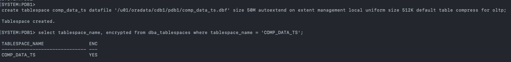
   
3. Run Compression Advisor for Advanced Row Compression
   
   **Note**: Again, here your numbers may be different then what is in the screenshot, but as long as they look similar, you good to keep progressing through the lab.

    ````
    <copy>
    SET SERVEROUTPUT ON
    DECLARE
      l_blkcnt_cmp   PLS_INTEGER;
      l_blkcnt_uncmp PLS_INTEGER;
      l_row_cmp      PLS_INTEGER;
      l_row_uncmp    PLS_INTEGER;
      l_cmp_ratio    NUMBER;
      l_comptype_str VARCHAR2(32767);
    BEGIN
      DBMS_COMPRESSION.GET_COMPRESSION_RATIO (
      scratchtbsname => 'COMP_DATA_TS' ,
      ownname	  => 'SH' ,
      objname	  => 'SALES' ,
      subobjname     =>  NULL ,
      comptype       =>  DBMS_COMPRESSION.COMP_ADVANCED,
      blkcnt_cmp     => l_blkcnt_cmp,
      blkcnt_uncmp   => l_blkcnt_uncmp,
      row_cmp	  => l_row_cmp,
      row_uncmp      => l_row_uncmp,
      cmp_ratio      => l_cmp_ratio,
      comptype_str   => l_comptype_str,
      subset_numrows => DBMS_COMPRESSION.comp_ratio_minrows,
      objtype	  => DBMS_COMPRESSION.objtype_table
      );
    DBMS_OUTPUT.put_line( 'Number of blocks used by the compressed sample of the object	:  ' || l_blkcnt_cmp);
    DBMS_OUTPUT.put_line( 'Number of blocks used by the uncompressed sample of the object	:  ' || l_blkcnt_uncmp);
    DBMS_OUTPUT.put_line( 'Number of rows in a block in compressed sample of the object	:  ' || l_row_cmp);
    DBMS_OUTPUT.put_line( 'Number of rows in a block in uncompressed sample of the object	:  ' || l_row_uncmp);
    DBMS_OUTPUT.put_line( 'Estimated Compression Ratio of Sample                       	:  ' || l_cmp_ratio);
    DBMS_OUTPUT.put_line( 'Compression Type							:  ' || l_comptype_str);
    END;
    /
    </copy>
    ````
    

4. Run Compression Advisor for Partition Tables
   
   **Note**: Again, here your numbers may be different then what is in the screenshot, but as long as they look similar, you good to keep progressing through the lab.

    ````
    <copy>
    SET SERVEROUTPUT ON
    DECLARE
      l_blkcnt_cmp   PLS_INTEGER;
      l_blkcnt_uncmp PLS_INTEGER;
      l_row_cmp      PLS_INTEGER;
      l_row_uncmp    PLS_INTEGER;
      l_cmp_ratio    NUMBER;
      l_comptype_str VARCHAR2(32767);
    BEGIN
      DBMS_COMPRESSION.GET_COMPRESSION_RATIO (
      scratchtbsname => 'COMP_DATA_TS' ,
      ownname	  => 'SH' ,
      objname	  => 'SALES' ,
      subobjname     =>  'SALES_Q4_2001' ,
      comptype       =>  DBMS_COMPRESSION.COMP_ADVANCED,
      blkcnt_cmp     => l_blkcnt_cmp,
      blkcnt_uncmp   => l_blkcnt_uncmp,
      row_cmp	  => l_row_cmp,
      row_uncmp      => l_row_uncmp,
      cmp_ratio      => l_cmp_ratio,
      comptype_str   => l_comptype_str,
      subset_numrows => DBMS_COMPRESSION.comp_ratio_minrows,
      objtype	  => DBMS_COMPRESSION.objtype_table
      );
    DBMS_OUTPUT.put_line( 'Number of blocks used by the compressed sample of the object	:  ' || l_blkcnt_cmp);
    DBMS_OUTPUT.put_line( 'Number of blocks used by the uncompressed sample of the object	:  ' || l_blkcnt_uncmp);
    DBMS_OUTPUT.put_line( 'Number of rows in a block in compressed sample of the object	:  ' || l_row_cmp);
    DBMS_OUTPUT.put_line( 'Number of rows in a block in uncompressed sample of the object	:  ' || l_row_uncmp);
    DBMS_OUTPUT.put_line( 'Estimated Compression Ratio of Sample                       	:  ' || l_cmp_ratio);
    DBMS_OUTPUT.put_line( 'Compression Type							:  ' || l_comptype_str);
    END;
    /
    </copy>
    ````

    

5. Run Compression Advisor for Advanced Index Compression
   
   **Note**: Again, here your numbers may be different then what is in the screenshot, but as long as they look similar, you good to keep progressing through the lab.

    ````
    <copy>
    SET SERVEROUTPUT ON
    DECLARE
      l_blkcnt_cmp    PLS_INTEGER;
      l_blkcnt_uncmp  PLS_INTEGER;
      l_row_cmp       PLS_INTEGER;
      l_row_uncmp     PLS_INTEGER;
      l_cmp_ratio     NUMBER;
      l_comptype_str  VARCHAR2(32767);
    BEGIN
      DBMS_COMPRESSION.get_compression_ratio (
        scratchtbsname  => 'COMP_DATA_TS',
        ownname         => 'SH',
        objname         => 'SALES_CUST_CHANNEL_PROMO_IDX',
        subobjname      => NULL,
        comptype        => DBMS_COMPRESSION.COMP_INDEX_ADVANCED_LOW,
        blkcnt_cmp      => l_blkcnt_cmp,
        blkcnt_uncmp    => l_blkcnt_uncmp,
        row_cmp         => l_row_cmp,
        row_uncmp       => l_row_uncmp,
        cmp_ratio       => l_cmp_ratio,
        comptype_str    => l_comptype_str,
        subset_numrows  => DBMS_COMPRESSION.comp_ratio_minrows,
        objtype         => DBMS_COMPRESSION.objtype_index
      );

      DBMS_OUTPUT.put_line('Number of blocks used (compressed)       : ' ||  l_blkcnt_cmp);
      DBMS_OUTPUT.put_line('Number of blocks used (uncompressed)     : ' ||  l_blkcnt_uncmp);
      DBMS_OUTPUT.put_line('Number of rows in a block (compressed)   : ' ||  l_row_cmp);
      DBMS_OUTPUT.put_line('Number of rows in a block (uncompressed) : ' ||  l_row_uncmp);
      DBMS_OUTPUT.put_line('Compression ratio                        : ' ||  l_cmp_ratio);
      DBMS_OUTPUT.put_line('Compression type                         : ' ||  l_comptype_str);
    END;
    /
    </copy>
    ````

    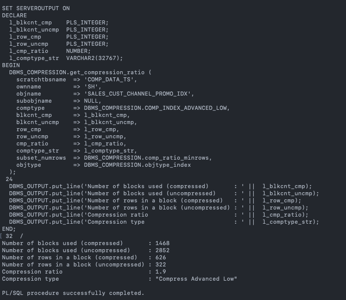

## Task 2: Compression Option 1: Offline compression method
   
   **Note**: **Offline Compression** uses **ALTER TABLE MOVE** syntax to move the data segment into a different tablespace. During the data segment reorganization, the downtime is required for the application due to the underlying serialization mechanism on the segment. Additionally, we need to rebuild all indexes associated with the moved data segments.

   **Online Compression** uses **Oracle Online Redefinition** technology. It is recommended approach for the customers who seek minimum downtime during the **Advanced Compress** and any other data reorganization operation. Online Redefinition only needs to lock the underlying segments for very short amount of time to sync the final changes to complete the segments reorganization. 
   
   You can read more about Online Redefnition from MOS note:
  - How to Compress a Table While it is Online (Doc ID 1353967.1)
  - Primary Note: Overview of Online Redefinition of Tables (DBMS_REDEFINITION) (Doc ID 1357825.1)
  - Online Redefinition using **"DBMS_REDEFINITION.REDEF_TABLE"** (Doc ID 2412059.1)
   
   ````
   <copy>
   ALTER TABLE SH.CAL_MONTH_SALES_MV MOVE TABLESPACE COMP_DATA_TS ROW STORE COMPRESS ADVANCED;
   ALTER TABLE SH.FWEEK_PSCAT_SALES_MV MOVE TABLESPACE COMP_DATA_TS ROW STORE COMPRESS ADVANCED;
   ALTER TABLE SH.DR$SUP_TEXT_IDX$K MOVE TABLESPACE COMP_DATA_TS ROW STORE COMPRESS ADVANCED;
   ALTER TABLE SH.DR$SUP_TEXT_IDX$U MOVE TABLESPACE COMP_DATA_TS ROW STORE COMPRESS ADVANCED;
   </copy>
   ````

   

## Task 3: Compression Option 2: Online compression via online redefinition REDEF_TABLE

1. Check the segment tablespace information before online compression 

    ````
    <copy>
    set pagesize 20
    col segment_name for a50
    select segment_name, segment_type, tablespace_name from dba_segments where owner='SH';
    </copy>
    ````

    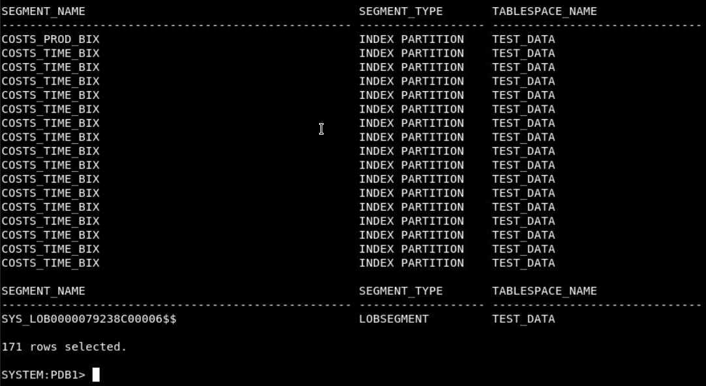

2. Redefine table online compressed for single table

    ````
    <copy>
    BEGIN
      DBMS_REDEFINITION.REDEF_TABLE(
        uname                        => 'SH',
        tname                        => 'PRODUCTS',
        table_compression_type       => 'ROW STORE COMPRESS ADVANCED',
        table_part_tablespace        => 'COMP_DATA_TS',
        index_key_compression_type   => 'COMPRESS ADVANCED LOW',
        index_tablespace             => 'COMP_DATA_TS',
        lob_compression_type         => 'COMPRESS HIGH',
        lob_tablespace               => 'COMP_DATA_TS',
        lob_store_as                 => 'SECUREFILE');
    END;
    /
    </copy>
    ````  

    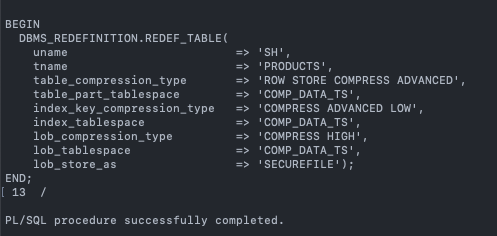

    ````
    <copy>
    set pagesize 20
    col segment_name for a50
    select segment_name, segment_type, tablespace_name from dba_segments where owner='SH' and tablespace_name in ('COMP_DATA_TS');
    </copy>
    ````

    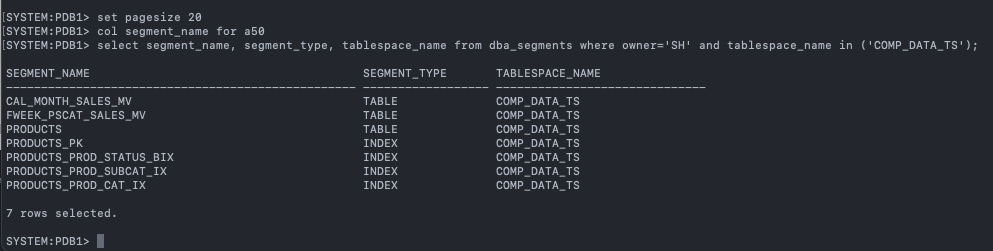

3. Automate Redefine table online compressed for multiple tables

    **Note**: This step may take a while, so do not worry if it seems to be taking a long time.

    ````
    <copy>
    DECLARE
      v_table_name VARCHAR2(100);
    BEGIN
      FOR rec IN (SELECT segment_name FROM dba_segments WHERE owner = 'SH' AND segment_type = 'TABLE' AND tablespace_name='TEST_DATA' UNION SELECT distinct table_name FROM dba_tab_partitions WHERE table_owner='SH' AND tablespace_name='TEST_DATA')
      LOOP
          v_table_name := rec.segment_name;
          
          BEGIN
            DBMS_REDEFINITION.REDEF_TABLE(
                uname                        => 'SH',
                tname                        =>  v_table_name,
                table_compression_type       => 'ROW STORE COMPRESS ADVANCED',
                table_part_tablespace        => 'COMP_DATA_TS',
                index_key_compression_type   => 'COMPRESS ADVANCED LOW',
                index_tablespace             => 'COMP_DATA_TS',
                lob_compression_type         => 'COMPRESS HIGH',
                lob_tablespace               => 'COMP_DATA_TS',
                lob_store_as                 => 'SECUREFILE');
          END;
      END LOOP;
    END;
    /
    </copy>
    ````  

    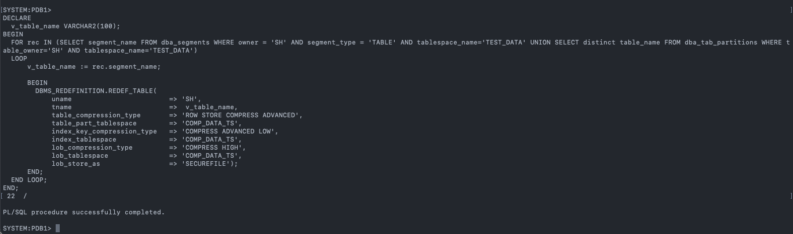

    ````
    <copy>
    set pagesize 40
    col segment_name for a50
    select segment_name, segment_type, tablespace_name from dba_segments where owner='SH' and tablespace_name in ('COMP_DATA_TS');
    </copy>
    ````

    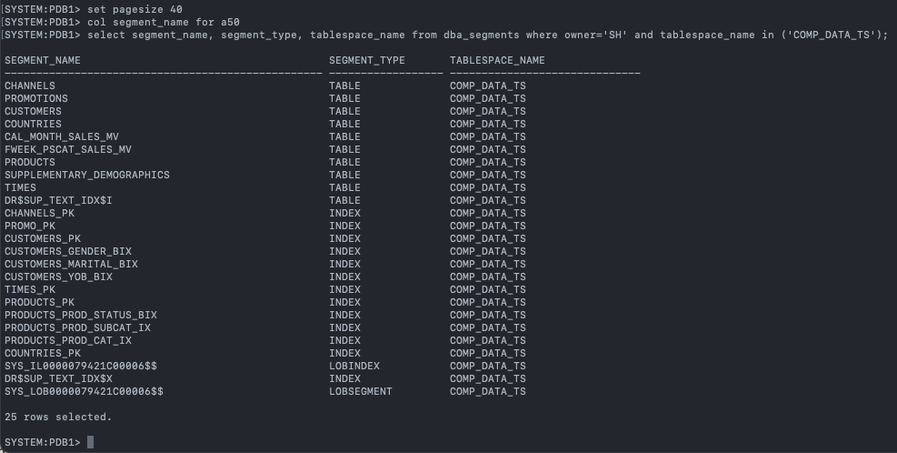

    Compare the previous segment space usage vesus the space usage after the compression
    ````
    <copy>
    select SEGMENT_TYPE,count(*),sum(bytes/(1024*1024)) SIZE_MB 
    from dba_segments 
    where TABLESPACE_NAME in ('COMP_DATA_TS') 
    and SEGMENT_TYPE in ('TABLE', 'TABLE PARTITION', 'INDEX PARTITION', 'INDEX')
    group by SEGMENT_TYPE order by SEGMENT_TYPE;
    </copy>
    ````

    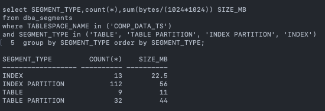

4.  Exit SQL Plus to the oracle user.

    ```
    <copy>
    exit
    </copy>
    ```
## Task 4: Space benefit of Oracle TDE with compression

  **Note**: Again, the numbers you get may be different then the screenshot, but the point is to show compression, so if that is still visible, you have done this lab successfully.

   ````
   <copy>
   du -hs /u01/oradata/cdb1/pdb1/comp_data_ts.dbf
   </copy>
   ````

   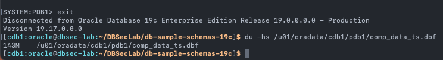

   As you can see here, we went from a size of 317MB to 143MB which is a significant decrease in size showing successful enablement of advanced compression for an encrypted tablespace. 

## (Option) Enable session parallelism to speed up compression process via online redefinition
   **Consider to use parallelism for compress your production database data**
   * Parallelism will use direct-path load, the compression engine can work with a large volume of rows to compress and write out compressed rows to the data blocks in a batch fasion, therefore, it is much efficient than conventional load. 
   * Using Parallelism using direct-path load mechanism, similar to when you use APPEND hint, the data is inserted above the segment high water mark, which potentially can use more space in the datafile. 

   **Parallel Online Redefinition For LOB Table (Doc ID 2315184.1)**
   ````
   <copy>
   sqlplus system/Oracle123@localhost:1521/pdb1
   ALTER SESSION ENABLE PARALLEL DML ;
   ALTER SESSION FORCE PARALLEL DML PARALLEL 2;
   ALTER SESSION FORCE PARALLEL QUERY PARALLEL 2;
   ALTER SESSION ENABLE PARALLEL DDL;
   ALTER SESSION FORCE PARALLEL DDL PARALLEL 2;
   exit
   </copy>
   ````

   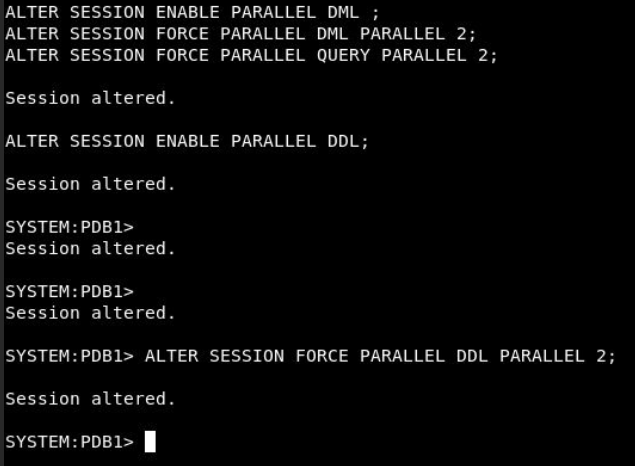

## Task 5: Restore the database if needed

1. First, execute this script to restore the pfile

    ````
    <copy>./tde_restore_init_parameters.sh</copy>
    ````

    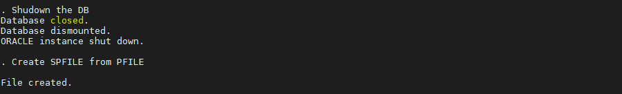


2. Second, restore the database (this may take some time)

    ````
    <copy>./tde_restore_db.sh</copy>
    ````

    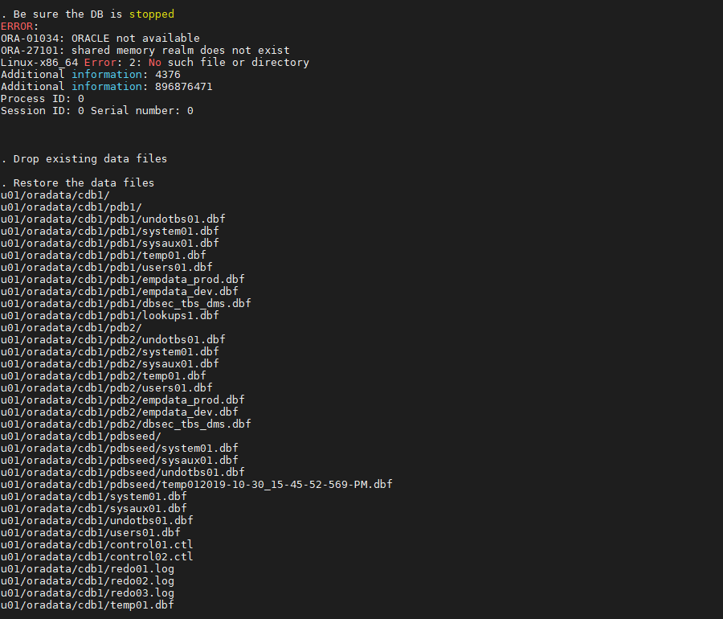

3. Third, delete the associated Oracle Wallet files

    ````
    <copy>./tde_delete_wallet_files.sh</copy>
    ````

    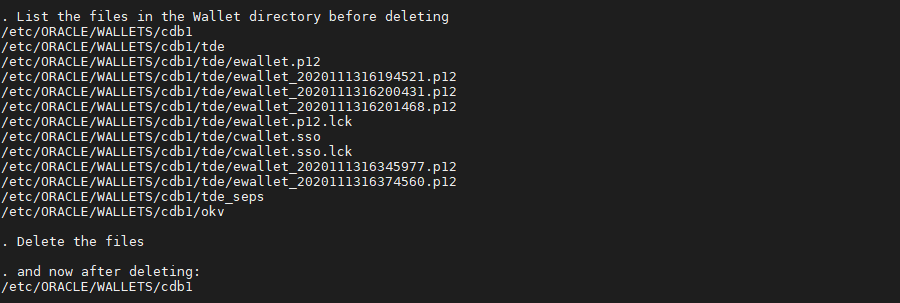

4. Fourth, start the container and pluggable databases

    ````
    <copy>./tde_start_db.sh</copy>
    ````

    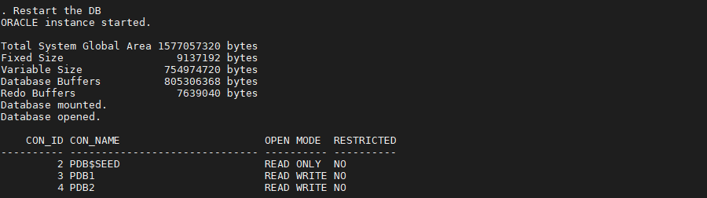

    **Note**: This should have restored your database to it's pre-TDE state!

5. Finally, verify the initialization parameters don't say anything about TDE

    ````
    <copy>./tde_check_init_params.sh</copy>
    ````

    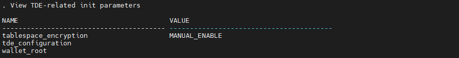

7. Now, your database is restored to the point in time prior to enabling TDE and you can remove your dabase backup (optional)!

    ````
    <copy>./tde_delete_backup_db.sh</copy>
    ````

    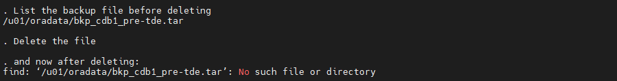


## Learn More
  - How to Compress a Table While it is Online (Doc ID 1353967.1)
  - Primary Note: Overview of Online Redefinition of Tables (`DBMS_REDEFINITION`) (Doc ID 1357825.1)
  - Online Redefinition using `DBMS_REDEFINITION.REDEF_TABLE` (Doc ID 2412059.1)
  - Use following `DBMS_REDEFINITION.REDEF_TABLE` procedure to update index and lob compression type and designated tablespaces
  - Reference : https://docs.oracle.com/en/database/oracle/oracle-database/19/arpls/DBMS_REDEFINITION.html#GUID-3E72906F-0A2D-4970-B299-DDBCC32CB5D3

  - [OLTP Compression](https://docs.oracle.com/cd/E29633_01/CDMOG/GUID-090FB709-9BC1-44C7-9855-B49AF8AAF587.htm) 
 
  -  For table partitions maybe use online move operation is better, after partition move, local indexes require rebuild
    - `ALTER TABLE sales MOVE PARTITION sales_q1_1998 TABLESPACE ts_arch_q1_1998 ROW STORE COMPRESS ADVANCED;`
    - `ALTER TABLE sales MODIFY PARTITION sales_q1_1998 REBUILD UNUSABLE LOCAL INDEXES;`
  - Iterate until all tables are compressed & encrypted.
  - Performance testing of application using existing tests
  - Compare to baseline.

  - Additional Notes:
    - Online redefinition restrictions :https://docs.oracle.com/en/database/oracle/oracle-database/19/admin/managing-tables.html#GUID-CB5589F0-B328-4620-8809-C53696972B4C
## Acknowledgements

* **Author**
  * Royce Fu, Principal Database Platform Specialist
  * Noah Galloso, Solution Engineer, North America Specialist Hub
* **Contributors**
  * Richard Evans, Database Security Product Management
* **Last Updated By/Date** -   